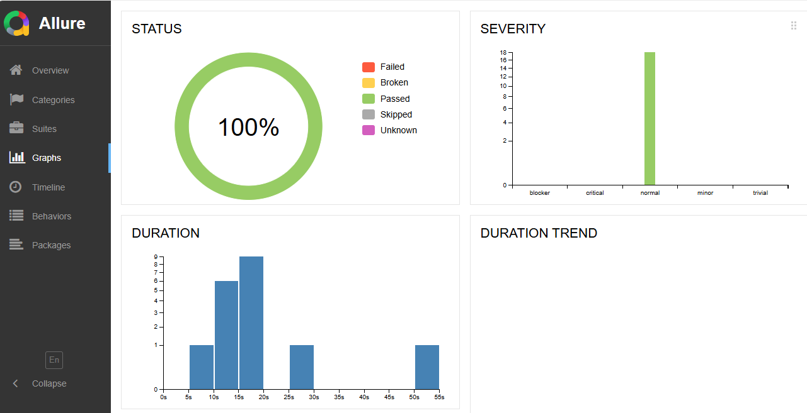

# Automated Web Interaction and Testing for Rokomari.com

## Contents
1. [Project Overview](#project-overview)
2. [Prerequisites](#prerequisites)
3. [Installation](#installation)
4. [Automation Steps](#automation-steps)
5. [Running Tests and Generating Reports](#running-tests-and-generating-reports)
6. [Graph Representation](#graph-representation)
7. [Version Compatibility](#version-compatibility)

## Project Overview
This project showcases the automation of various user interactions on Rokomari.com, an online bookstore. The primary goal is to practice and demonstrate web automation skills using Selenium and Java. The automation script performs a sequence of actions that simulate a typical user journey on the website, including signing up using Google, browsing for books by a specific author, filtering book categories, adding a book to the cart, and proceeding through the checkout process.

## Prerequisites
- Java Development Kit (JDK)
- Selenium Java bindings
- ChromeDriver or appropriate WebDriver for your browser
- A Maven or Gradle build tool (optional for dependency management)

## Installation
1. Clone the repository:
   
   git clone https://github.com/yourusername/rokomari-automation.git
   
   cd rokomari-automation
2. Install the required packages:
If using Maven, ensure the `pom.xml` file includes dependencies for Selenium.

3. Download and set up the WebDriver (e.g., ChromeDriver):
- Ensure the WebDriver is in your PATH or specify its location in your script.

## Automation Steps
**1. Sign Up using Google**
Automates the process of signing up on Rokomari.com using a Google account.

**2. Select লেখক from the menu**
Navigates to the 'লেখক' section from the menu.

**3. Select হুমায়ুন আহমেদ**
Chooses the author 'হুমায়ুন আহমেদ' from the list of authors.

**4. Filter Categories**
Filters books by categories such as 'সমকালীন উপন্যাস' and 'রচনা সংকলন ও সমগ্র'.

**5. Scroll Down and go to Next Page**
Scrolls through the list of books and navigates to the next page if available.

**6. Add to the cart any book**
Adds a selected book to the cart.

**7. Click Cart Icon**
Opens the cart to review added items.

**8. Go to the Shipping page**
Proceeds to the shipping information page.

**9. Provide your Shipping Information**
Fills in the required shipping information.

**10. Log out**
Logs out of the Rokomari account.

## Running Tests and Generating Reports
**1. Run Tests:**
Use Maven to run your tests:

`sh`
mvn test

If you want to run tests with specific configurations, you can use the following command:

`sh`
mvn test -D"browserName=Chrome" -D"xmlFileName=testng.xml"

This command allows you to specify the browser and the TestNG XML file to use for running the tests. Adjust the values according to your requirements:

- browserName: Specify the browser you want to use for testing (e.g., Chrome, Firefox).
- xmlFileName: Specify the TestNG XML file containing the test suite configuration.

**2. Generate Allure Report:**
After running the tests, generate the Allure report:

`sh`
allure generate .\allure-results\ --clean

**3. Open Allure Report:**
Open the generated Allure report:

`sh` allure open .\allure-report\

## Version Compatibility
If you encounter any issues related to version compatibility with the dependencies used in this project, you may need to adjust the versions accordingly.Here are some steps you can take:

**1. Check Dependency Versions:** Review the versions of dependencies specified in the pom.xml file for Maven projects or the build.gradle file for Gradle projects.

**2. Update Versions:** If necessary, update the versions of dependencies to match the requirements of your environment or project.

**3. Test with Different Versions:** After updating the versions, thoroughly test the project to ensure compatibility and functionality.

**4. Community Support:** If you encounter persistent issues or require assistance with version compatibility, seek help from the community forums, documentation, or support channels related to the specific dependencies used.

## Graph Representation

